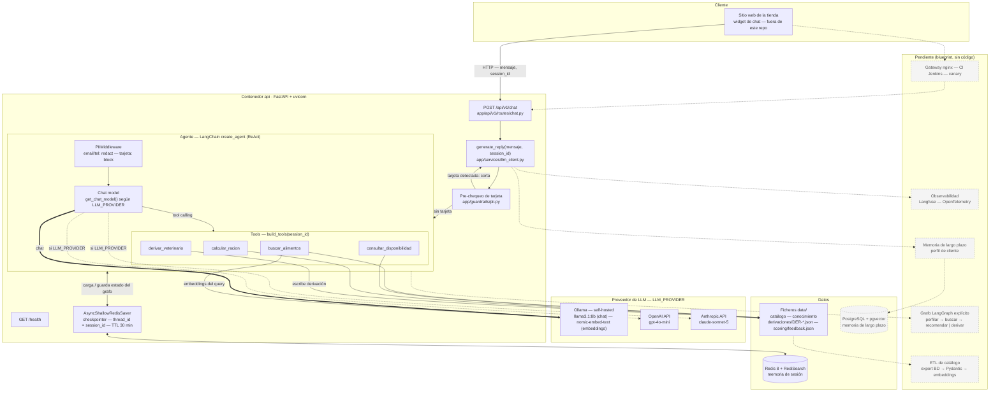
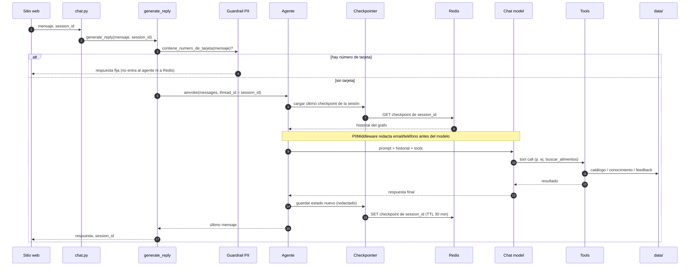

# Arquitectura de componentes · VethisAgent

Estado real del repo `project-agent` (backend del asesor de tienda veterinaria).
GitHub y varios editores renderizan Mermaid directo; si no, pegá el bloque en
<https://mermaid.live>.

- **Línea sólida / nodo blanco** = implementado y corriendo hoy.
- **Línea punteada / nodo gris** = diseñado en el blueprint, aún no en el código.

---

## Diagrama de componentes

---

## Flujo de una petición `POST /api/v1/chat`

---

## Despliegue (`docker-compose.yml`)

| Contenedor | Imagen | Rol | Puerto |
|---|---|---|---|
| `vethis-api` | build local (`python:3.11-slim`) | backend FastAPI | 8000 |
| `vethis-redis` | `redis:8-alpine` | memoria de sesión (checkpointer, necesita RediSearch) | 6379 |
| `vethis-ollama` | `ollama/ollama` | embeddings (y chat si `LLM_PROVIDER=ollama`) | 11434 |
| `vethis-ollama-pull` | `ollama/ollama` | job de un solo uso: descarga los modelos | — |
| `vethis-postgres` | `pgvector/pgvector:pg16` | memoria de largo plazo — **levanta pero la app no se conecta** | 5432 |

Sin gateway, sin CI, sin orquestador: todo en una máquina con `docker compose`.
